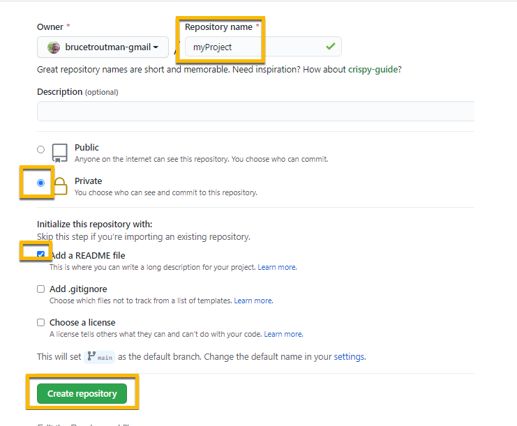

<a class="page-back" href="Setup/fr0050_Setup-SSH-Key-Files.md">BACK - Create SSH Keys</a>
<a class="page-next" href="Setup/fr0102_Simple-Node-Apps.md">Create a Simple NodeJS App - NEXT</a>

## Instructions for setting up a MERN stack development workstation

#### Introduction
The following steps create the development environment on your workstation for developing an MERN stack (MYSql, Express, React and Node) application. You will access a repository on github and modify it, run it and push changes back to github. We will be using an empty 'Windows Pro N' VM in these instructions. You should be able to use any workstation. Just follow the steps. 
#### Steps to set up your development workstation
<br> 

### 1. Install any updates to your workstation.


### 2. Create 3 folders, change View Options and setup ssh and create keys

-  C:\

```
 'repos' (local copies of your gitHub repos)
 'remotes' (local copies of remote server files)
```


-  C:\users\(username)\.ssh

```
 '.ssh' (holds your ssh keys)
```


- Change View Options in File Explorer

```
Enable Extentions and Hidden Files
```

 


- Test if OpenSSH client is installed.

```
From DOS command prompt run ssh.
```

- OpenSSH client Not installed


- Install OpenSSH in Apps & Features - Optional Features


- OpenSSH client is installed


- Create 3 ssh keys. These keys will be used for GitHub, your Cloud Provider and your Remote server. Run from 

```
Format:

ssh-keygen -t rsa -g -f 
"<local user folder>/.ssh/
<key owner name>@<host name>_<host user name>_v<date>_key"
-C "<key owner name>@<host name>_<host user name>_v<date>"
```

```
1. Key pairs for Github:

ssh-keygen -t rsa -g -f "c:/Users/local_admin/.ssh/bruce.troutman@github_btg_v210713_key" -C "bruce.troutman@github_btg_v210713"
```


```
2. Key pairs for Cloud Provider:

ssh-keygen -t rsa -g -f "c:/Users/local_admin/.ssh/bruce.troutman@Vultr_btg_v210713_key" -C "bruce.troutman@Vultr_btg_v210713"
```


```
3. Key pairs for access to Remote Server on Cloud Provider:

ssh-keygen -t rsa -g -f "c:/Users/local_admin/.ssh/bruce.troutman@Formr1-Vultr_nimda_v210713_key" -C "bruce.troutman@Formr1-Vultr_nimda_v210713"
```


- View created key files:


###    3. Install or open Chrome browser

- Download Chrome from:

```
https://www.google.com/google_chrome/download
```


- Install Chrome Extensions

```
https://chrome.google.com/webstore/category/extensions?hl=en-US
```


- Add Markdown Preview Plus


- Allow access to file URLs 

```
chrome://extensions/?id=febilkbfcbhebfnokafefeacimjdckgl
```


- Add React Developers Tools

```
https://chrome.google.com/webstore/category/extensions?hl=en-US
```


- Check the installations

```
chrome://extensions/
```


###    4. Create an account or sign into GitHub then Add your ssh key.

- GitHub

```
http://githib.com
```


- Add your Github ssh key from your .ssh folder to your github account


- Create a new repository: 'myProject'.

```
https://github/new 

Select Private and check ReadMe file, then click Create Repository. 
```



- Edit the Readme.md file

```
Click the pencil
```


```
Change to:

# myProject was created on mm/dd/yyyy.
```


- Commit changes

```
go to the bottom of the edit page to the Commit Changes section.
```


###    5. Configure ssh Access to Github

- Create Host for github connection in the .ssh/config file. 

```
Open or create .ssh/config file and add the following:

Host github-btg
    HostName       github.com
    IdentityFile   C:/Users/Local_Admin/.ssh/bruce.troutman@github_btg_v210713_key
    User           git
```


- From the DOS command window, test the connection to github.

```
ssh github-btg
```


###    6. Download Git, if not already installed

- Download from
```
 https://git-scm.com/download/win
```


- Allow changes

 

- Select all the default values and install


- Finish Install


- Open Git Bash


###    7. Open or Install VSCode

- Install from

```
https://code.visualstudio.com/download

Accept all the defaults for installation
```


- Pin it to Task Bar 


- Install Extensions


    - GitLens


    - Prettier


    - React Snippets


- Click File.. AutoSave


- Change default terminal in VSCode

```
Using Notepad, edit:
 
 C:\Users\xxxxxxxxxx\AppData\Roaming\Code\User\settings.json 
 
 and add this line at the bottom of the file:

"terminal.integrated.shell.windows": "C:\\Program Files\\Git\\bin\\bash.exe",  
```
  


- From VSCode open a new Terminal


- Close VSCode

###    8. Clone myProject

- Using File Explorer open git bash in c/repos folder

```
Navigate to repos, right click and Open Git Bash here
```


- Clone myProject from github into the local repos folder

```
git clone github-btg:brucetroutman-gmail/myProject.git
```


- Open myProject in VScode

```
cd myProject

code .
```


- Trust the authors


- Close the VSCode Welcome window

 


- Click File.. Save Workspace as: myProject.code.workspace


###    9. Markdown Preview test

- Open MyProject in VSCode and click on the ReadMe.md file and add these lines:
```
    1. My first update was changed locally.
    
    2. I previewed it in VSCode and Chrome.
```


- Click View.. Command Palette and type: >Markdown: Open Preview to the Side, your preview will display.


- From File Explorer right click on Readme.md then Open With and navigate to Chrome.exe, your preview will display.


 


###    10. Push and Pull with GitHub

- From VSCode.. Click the Control Source icon with the 2

 

- In the Message textbox, type: Updated Readme.md

 

- Click on the Commit checkmark above the Message textbox

 

-  From the Source Control menu, click the three dots (...) More menu, and click Push.

 

- Login to GitHub and select the myProject repository then click Readme.md, it should be updated.


 
- Modify Readme.md in Github by adding these lines:
```
3. I updated it in GitHub.

4. I pulled it to my local repo using VScode
``` 

 

- Commit the change.

 

- In VSCode, From the Source Control menu, click the three dots (...) More menu, and click Pull. 

 

- The Github changes will now appear in the Readme.md file.

 

###    11. Install Node for Windows
1. Browse to: nodejs.org/en/downloads
2. Install using all the defaults.


3. Test from Windows command prompt:
```
    node --version
    npm --version
```    


###    12. Install MySql for windows 
1. Follow the instructions at: https://dev.mysql.com/doc/mysql-windows-excerpt/5.7/en/windows-installation.html
2. Choose the version: mysql-installer-community-8.0.23.0.msi


3. Select No, thanks, just start my download


4. Choose Stup Type: Custom


5. Select Products (Version = 8.0.23 -x64)
    1. MySQL Server
    2. MySQL Workbench
    3. MySQL Shell
    4. MySQL Router
    5. Connector/ODBC
    6. Connector/J
    7. MySQL Documentation
    8. Samples and Examples


6. Enter Account password


7. Connect to Server


8. Windows Service


9. Apply Configuration


10. Installation Complete


11. Open MySQL Shell and MySQL WorkBench.


12. WorkBench login


13. WorkBench SHOW DATABASES


14. Shell login


15. Shell SHOW DATABASES


###    13. Install BitVise ssh client and Pin to Task Bar
1. Install Bitvise from: https://www.bitvise.com/ssh-client-download


2. Accept the defaults.


###    14. Install TextPad
1. Install Textpad from: https://www.textpad.com/download#TextPad851


2. Accept the defaults.


<br/>
<h3> Congratulations! Your Developer Workstation is setup.</h3>

 After all installations on a new Windows 10 machine, 27GB was used on Drive C:.

<a class="page-back" href="Setup/fr0050_Setup-SSH-Key-Files.md">BACK - Create SSH Keys</a>
<a class="page-next" href="Setup/fr0102_Simple-Node-Apps.md">Create a Simple NodeJS App - NEXT</a>
