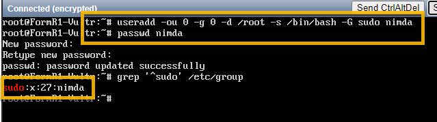

## Instructions for Hardening the Ubuntu server.

### 1. Login as root to the Ubuntu server on your Vultr console


### 2. Create a new sudo user
- Create a new user alias with root privileges. This user will login remotely.
```
useradd -ou 0 -g 0 -d /root -s /bin/bash -G sudo nimda
passwd nimda
```
- Check to see if nimda is in sudo group
```
grep '^sudo' /etc/group
```



- Check user info
```
cat /etc/passwd
```


### 3. Update and upgrade server

```
apt-get update && apt-get upgrade
```


### 4. Install and Configure unattended-updates

- Install
```
apt-get install unattended-upgrades
```


- Check installation
```
systemctl status unattended-upgrades
```


- Modify apt.conf.d/50unattended-upgrades
```
nano /etc/apt/apt.conf.d/50unattended-upgrades
```
- Uncomment the “updates” line by deleting the two slashes at the beginning of it:
```
"${distro_id}:${distro_codename}-updates";
```


- Uncomment and modify:
```
Unattended-Upgrade::Remove-Unused-Kernel-Packages "true";
Unattended-Upgrade::Remove-Unused-Dependencies "true";
Unattended-Upgrade::Automatic-Reboot "true";
Unattended-Upgrade::Automatic-Reboot-Time "02:38";
```


- Save the file

- Enable Automatic Updates
```
nano /etc/apt/apt.conf.d/20auto-upgrades
```
- Add these lines:
```
APT::Periodic::Update-Package-Lists "1";
APT::Periodic::Download-Upgradeable-Packages "1";
APT::Periodic::AutocleanInterval "7";
APT::Periodic::Unattended-Upgrade "1";
```


- Save the file

- Check if Unattended Upgrades works

```
unattended-upgrades --dry-run --debug
```


- Reboot the server
```
reboot
```

### 5. Secure Shared Memory
- Edit  fstab
```
nano /etc/fstab
```
- Add the following line to the bottom of that file:
```
tmpfs /run/shm tmpfs defaults,noexec,nosuid 0 0  
``` 
- Save and close the file and reboot the server.
```
reboot
```


### 6. Enable SSH Login for Specific Users Only

- Edit sshd_config
```
nano /etc/ssh/sshd_config
```


- At the bottom of the file, add the line: (Use your own username and your workstation's IP address)

```
AllowUsers nimda@xxx.xxx.xxx.xxx
```


- Save and close the file and restart sshd with this command:

```
systemctl restart sshd
```
### 7. Include a Security Login Banner

- Create a banner file
```
nano /etc/issue.net
```
- Add a warning message

```
************************************************************************

 Warning!!! This server is dedicated for FormR purposes.
     
 Malicious users will be subject to civil and/or criminal prosecution.
     
************************************************************************
```

-  Save and close the file.


- Disable the banner message from Message Of The Day (motd).
```
nano /etc/pam.d/sshd
```

- Comment out the following two lines (adding a # to the beginning of each line):
```
#session optional pam_motd.so motd=run/motd.dynamic
#session optional pam_motd.so noupdate
```


     
- Edit sshd_config

```
nano /etc/ssh/sshd_config
```
- Replace

```
#Banner none   with    Banner  /etc/issue.net
```


- Save and close the file and restart the SSH server
     
```
systemctl restart sshd
```
- When someone logs into your server using SSH, they see your newly added banner warning them of any consequences of further action. 

### 8. Fail2ban

- Install
```
apt-get install fail2ban
```


- Configure Fail2Ban
```     
nano /etc/fail2ban/jail.local
```

- In this new file, add the following contents:
```
[sshd]
enabled = true
port = 22
filter = sshd
logpath = /var/log/auth.log
maxretry = 3
```


- This configuration enables the jail, sets the SSH port to be monitored to 22, uses the sshd filter, sets the max login tries, and sets the log file to be monitored.

- Save and close that file and restart fail2ban with the command:
```
systemctl restart fail2ban
```
- Attempts to login to the server and fail the three times, access is blocked from the IP address. 

### 9. Enable firewall

- Allow ssh connections through firewall
```
ufw allow OpenSSH
```

- Enable firewall
```
ufw --force enable
```

- Check firewall status
```
ufw status
```


### 10. Set the server time zone
```
timedatectl set-timezone America/New_York 
```
- Check TimeZone
```
timedatectl
```


### 11. Create Snapshot of server in Vultr

- From Vultr console select snapshots


- Add a label, take snapshot


- List Snapshots


### Next Step - Install Web Server: 

## [Install Web Server](../Setup/fr0303_Setup-Web-Server-Ubuntu.md)

