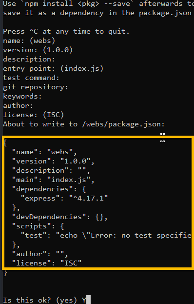
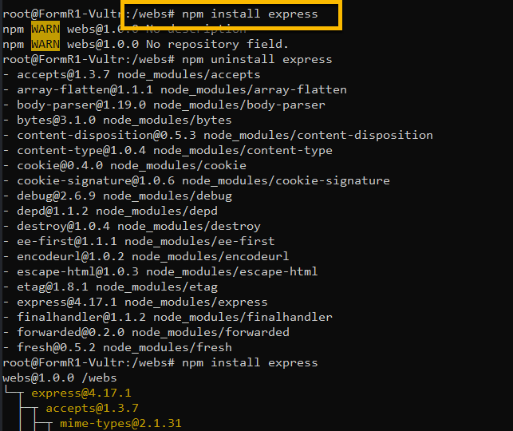
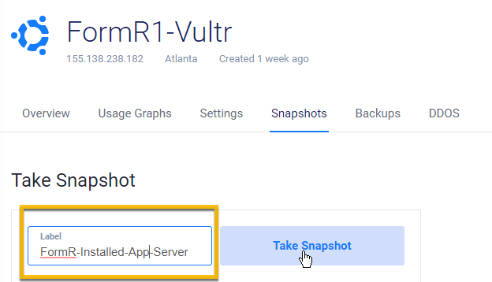

# Setup Instructions for application server, NodeJS, on Ubuntu

## Login as root to the Ubuntu server on your Vultr console

### 1. Install nodejs

- Install
```
apt-get install nodejs
```


- Check
```
nodejs --version
```


### 2. Install npm

- Install
```
apt-get install npm
```


- Check
```
npm --version
```


### 3. Install  pm2

- Install
```
npm install -g pm2
```


- Check
```
ps -aux | egrep 'pm2'
```


- Configure pm2 to start automatically on system startup
```
pm2 startup systemd
```


### 4. Install Docsify
```
 npm install docsify -g
 ```


- Check
```
ps -aux | egrep 'docsify'
```


### 5. Install Express
```
cd /webs
npm init
```


```
npm install express
```



### 6. Create Snapshot of server in Vultr
``` 
Use label: FormR-Installed-App-Server
```




### Next Step - Install Database Server: 

## [Install Database Server](../Setup/fr0305_Setup-Data-Server-Ubuntu.md)
