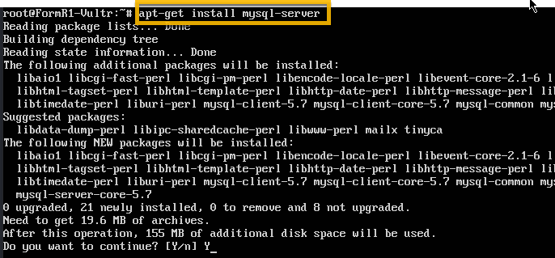
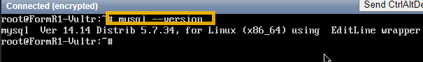
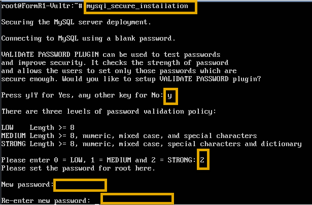
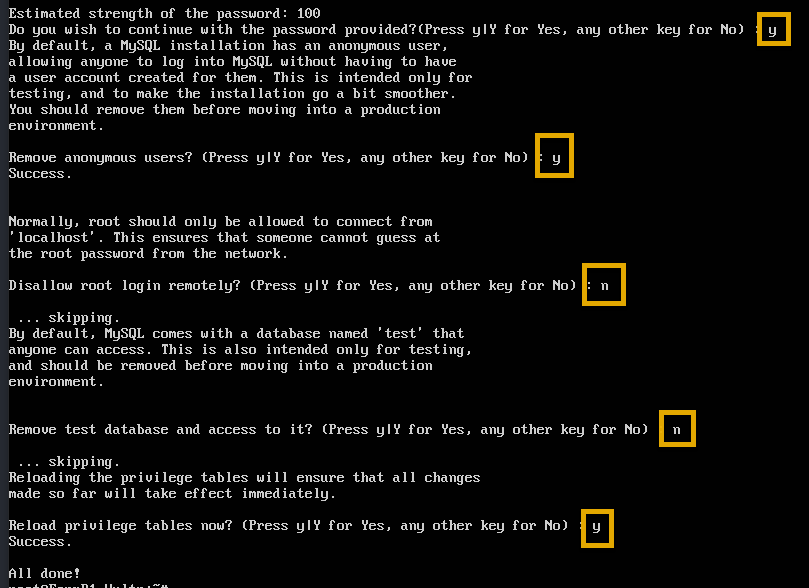
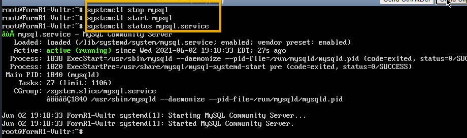

# Setup Instructions for VM with MySQL on Vultr

## Login as root to the Ubuntu server on your Vultr console


### 1. Install MySQL

- Install 
```
apt-get install mysql-server
```


- Check
```
mysql --version
```


### 2. Secure MySQL

- Lock down MySQL - Running this script will ask you

```
mysql_secure_installation
```
      - Add password validation policy: Yes
      - Enter a "password validation policy level": 2
      - Enter a password for the user, root, to login to MySQL: xxxxxx
      - Remove anonymous users? Yes
      - Disallow root login remotely? No (Yes on a production server)
      - Remove test database and access to it? No 
      - Reload privilege tables now? Yes






- Stop, Start and check status of MySQL
```
systemctl stop mysql
systemctl start mysql
systemctl status mysql.service
```




- Check MySql version.
```
mysqladmin -p -u root version
```


- Exit mysql
```
mysql /quit
```


- Allow remote access to MySQL (from Ubuntu console)
```
nano /etc/mysql/mysql.conf.d/mysqld.cnf

Change line:         bind-address            = 127.0.0.1
to:                  bind-address            = 0.0.0.0
```


```
systemctl restart mysql.service
netstat -tulnp | grep mysql
```


- Open firewall rule for port 3306
```
ufw allow 3306/tcp
```


- Create and Grant Privileges to user account: nimdas with host %
    - Note: root@localhost has all rights and nimdas@% has all rights

   ```
   mysql -p
      password: xxxxxxxxxx

   mysql> CREATE USER 'nimdas'@'%' IDENTIFIED WITH mysql_native_password BY 'xxxxxxxxxxxx';
   mysql> GRANT ALL PRIVILEGES ON *.* TO 'nimdas'@'%';
   mysql> SELECT user,authentication_string,plugin,host FROM mysql.user;
   ```


 8. Stop and Start mysql From the VM console:
 ```
 systemctl stop mysql
 systemctl start mysql
 ```

 9. Login as nimdas remotely from your local PC with MySQL Shell. --Don't save the password--

```
mysqlsh \connect nimdas@xxx.xxx.xxx.xxx:3306

mysqlsh \sql SELECT user,authentication_string,plugin,host FROM mysql.user;
```


 10. From Ubuntu console check disk usage and that MySQL is running

```
df

ps -aux | awk /mysqld/
```


 
### Next Step - Create Website with SSL on your server: 

## [Create Website with SSL](../setup/fr0306_Setup-Website-SSL-Ubuntu.md)
