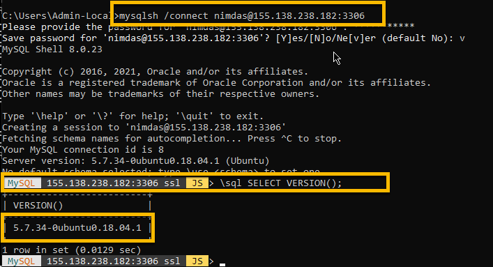

<a class="page-back" href="Setup/fr0304_Setup-App-Server-Ubuntu.md ">BACK - Install App Server</a>
<a class="page-next" href="Setup/fr0306_Setup-Website-SSL-Ubuntu.md">Install Website SSL - NEXT</a>

## Setup Instructions for Data server using MySQL on a Vultr Ubuntu VM

 - Login as root to the Ubuntu server on your Vultr console


### 1. Install MySQL

- Install 
```
apt-get install mysql-server
```


- Check
```
mysql --version
```


### 2. Secure MySQL

- Lock down MySQL - Running this script will ask you

```
mysql_secure_installation

      - Add VALIDATE PASSWORD PLUGIN: Yes
      - Enter a "password validation policy level": 2
      - Enter a password for the user, root, to login to MySQL: xxxxxx
      - Remove anonymous users? Yes
      - Disallow root login remotely? No (Yes on a production server)
      - Remove test database and access to it? No 
      - Reload privilege tables now? Yes
```


- Allow remote access to MySQL 

```
nano /etc/mysql/mysql.conf.d/mysqld.cnf

Change line:         bind-address = 127.0.0.1
to:                  bind-address = 0.0.0.0
```


- Save the file

- Restart mysql and comfirm its running

```
systemctl restart mysql.service
netstat -tulnp | grep mysql
```


- Open firewall rule for port 3306
```
ufw allow 3306/tcp
```


- Create and Grant Privileges to user account: nimdas with host %
(Note: root@localhost has all rights and nimdas@% will have all rights)

```
root@FormR-Vultr:~# mysql -p
password: xxxxxxxxxx

mysql> CREATE USER 'nimdas'@'%' IDENTIFIED WITH mysql_native_password BY 'xxxxxxxxxxxx';
mysql> GRANT ALL PRIVILEGES ON *.* TO 'nimdas'@'%';
mysql> SELECT user,authentication_string,plugin,host FROM mysql.user;
```


- Exit mysql
```
mysql> \quit
```


- Stop, Start and check status of MySQL
```
systemctl stop mysql
systemctl start mysql
systemctl status mysql.service
```


### 3. Login as nimdas remotely from your local PC with MySQL Shell. --Don't save the password-- 

- Login
```
C:\mysqlsh /connect nimdas@xxx.xxx.xxx.xxx:3306
```
- Check Version
```
mysql xxx.xxx.xxx.xxx:3306 JS> \sql SELECT VERSION();
```


 
- Exit mysqlsh
```
mysql xxx.xxx.xxx.xxx:3306 JS> \quit
```

<!--
### Next Step - Create Website with SSL on your server: 
## [Create Website with SSL](../Setup/fr0306_Setup-Website-SSL-Ubuntu.md)
-->

<a class="page-back" href="Setup/fr0304_Setup-App-Server-Ubuntu.md ">BACK - Install App Server</a>
<a class="page-next" href="Setup/fr0306_Setup-Website-SSL-Ubuntu.md">Install Website SSL - NEXT</a>
