<a class="page-back" href="Setup/fr0305_Setup-Data-Server-Ubuntu.md">BACK - Install Database Server</a>
<a class="page-next disabled">NEXT</a>
## Setup Instructions for creating a simple website with SSL

1. Use Bitvise securely. Open Bitvise on your local workstation and login as nimda to the Ubuntu server

 - Bitvise Initial Login with password
```
 "C:\Program Files (x86)\Bitvise SSH Client\BvSsh.exe"
```

 - Click New Profile
 


 - Enter:
  Host IP address: xxx.xxx.xxx.xxx.
  Port: 22
  Username: nimda
  Initial Method: password
  Password: xxxxxxxxx


  
- Click log In (You will see Warning message and then be logged in via password)


- Click Save profile icon and save as FormR1-Vultr-nimda


2. Configure Login via Public Key (SSH keys are more secure than passwords)

- Open Bitvise profile, Formr-Vultr-nimda, click Log in, then click New SFTP window icon


  - Right click in remote files pane (right)

    - create folder: /root/.ssh


    - navigate to folder /root/.ssh and create file: authorized_keys


 

  - In local files panes (left)
    - Navigate to C:/users/(your local computer username)/.ssh and edit the public key file (This file was created when the Vultr server was created)
    - Copy the one line of text. e.g.
    ssh-rsa AAAAB3NzaC1yc2EAAAADAQABAAABAQDJjD5Am/Zphxu4m2kdd+5peA968irTcwmtp/uNglxgVe8FJCRmRriduuizc18UMprFoVA7yjI1Vk/OBc4LgW9F1R7RfQvq2T3KESqfKNbgxMUL5Kvy+7FoBHCUWd4fM+kG9jphAlUb2olVL+NfuU2bIX5q5L8pMURDPnTBROasfxUNhcYJCIsowC0J0tbZuSrmnfh5wyXMFjoQht0vCB2Fqp7RToTkCFCSoYSKOH0w69afIbEqbPLBz2T9ahiH6d59OQl8Zdnz0knGWYwHuWX9J6vku0H6JB72oLEnweETjuvELW3NX+QFZQQzNayaHiDXGexQ/kTEN1AxyuxbbVLL brucetroutman_v210511

 

 


  - In the Remote Files pane (right)
      - Edit the file /root/.ssh/authorized_keys

 

      - Paste the public key text and Save


      - close SFTP window

  - From the Profile window
    - Logout 
    - Change Authentication, Initial method from 'password' to 'public key' and Click the Client Key Manager link, then click Import


    - Select 'All files' then select the Private key file that matched the previously used Public key then Click Import and close Client Key Manager


    - Select the just imported key (Profile 1) from the Client key drop down and Click Login (You will be logged in via public key)


    - IMPORTANT -- Click Save Profile !!!


3. Using Bitvice New Terminal console delete nginx default files 

```
unlink /etc/nginx/sites-available/default

unlink /etc/nginx/sites-enabled/default
```


4. Clone simpleApp using git 
```
cd /webs
git clone https://github.com/brucetroutman-gmail/simpleApp.git SimpleApp
```
- Confim clone
```
cd simpleApp
ls
```
- Open port 5000 through the firewall
```
ufw allow 5000
```


- Start app.js on the server
```
node app.js
```


- Use your local browser to test your server
```
xxx.xxx.xxx.xxx:5000
```


5. Setup pm2 to run website automatically
```
pm2 start app.js 
```

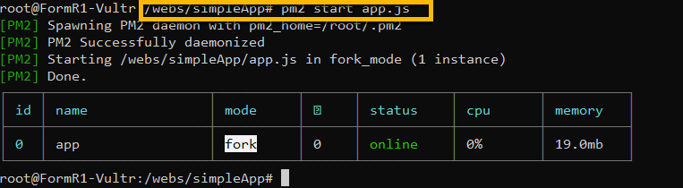

- Allow pm2 to start on boot up
```
pm2 startup systemd
```

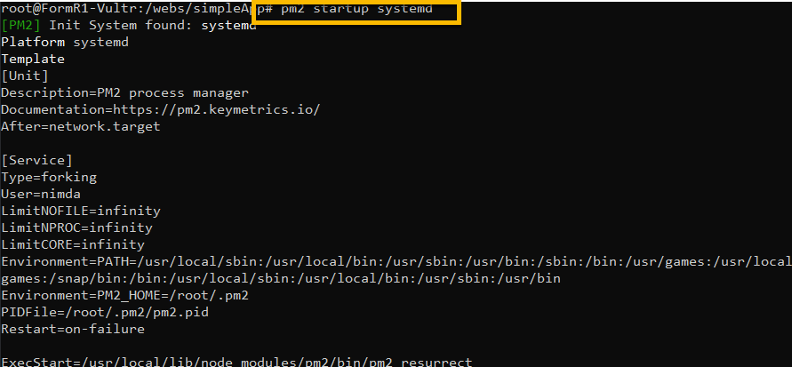

- Save pm2 configuration
```
pm2 save --force
```

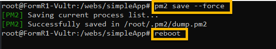

- Reboot server and test from local browser, xxx.xxx.xxx.xxx:5000


6. Setup nginx proxy 

- Copy simpleApp.conf file
```
cp /webs/simpleApp/etc/nginx/sites-available/simpleApp.conf /etc/nginx/sites-available/simpleApp.conf
```

- Create symbolic link to /etc/nginx/sites-enabled  
```
ln -s /etc/nginx/sites-available/simpleApp.conf /etc/nginx/sites-enabled/simpleApp.conf
```

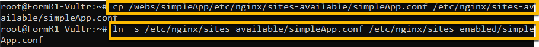

- Test and Reload nginx
```
nginx -t
systemctl reload nginx
```

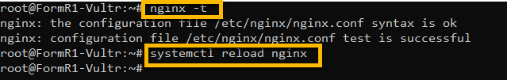

7. Point DNS to server
```
Update your DNS record to point formr.net to the server IP address.
```

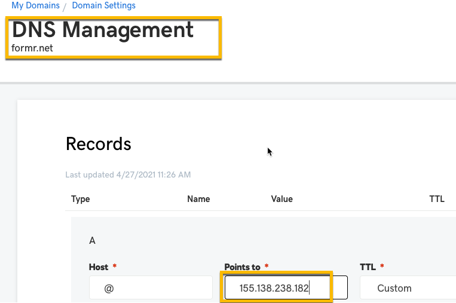

8. Test your website

- Browse to your web site via http
```
http://yoururl
```

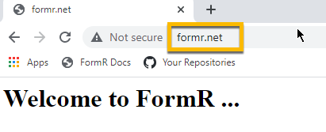

9. Add SSL certificate using Letsencrypt
```
certbot --nginx -d yoururl -d www.yoururl
```

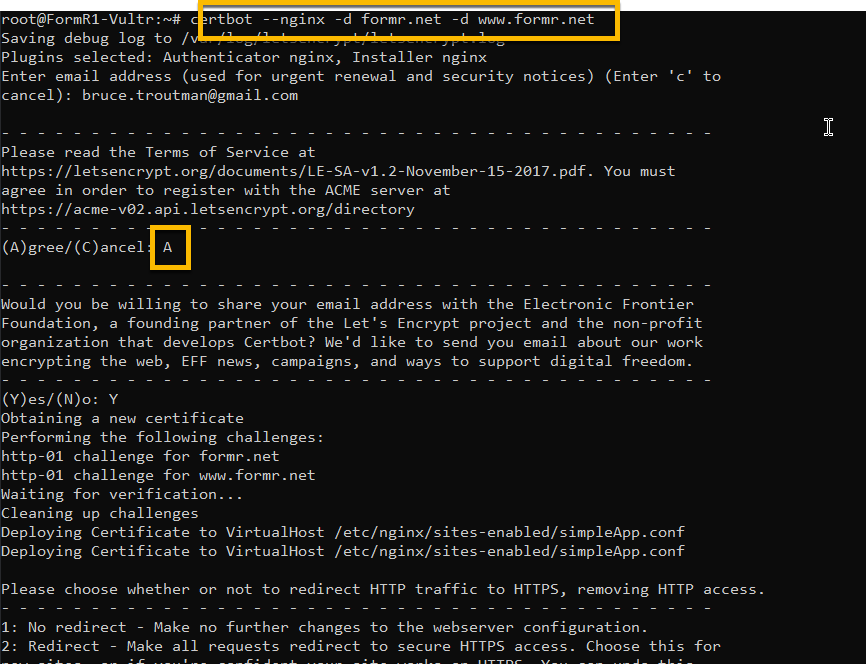

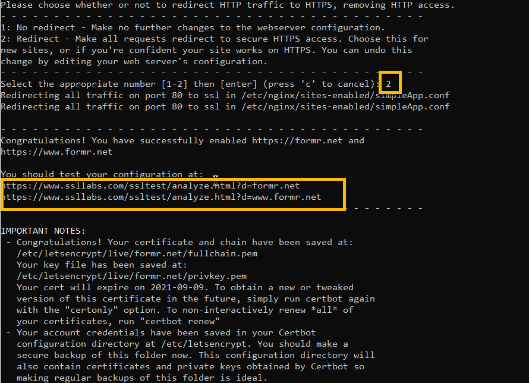

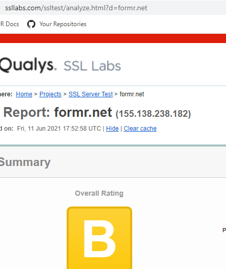

- Browse to your web via https
```
https://yoururl
```

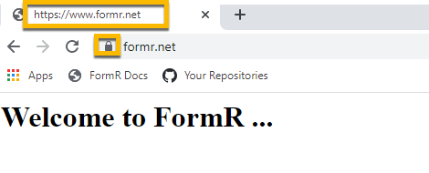

9. Close port 5000
```
   ufw status numbered

   ufw delete 8

   ufw delete 4
```

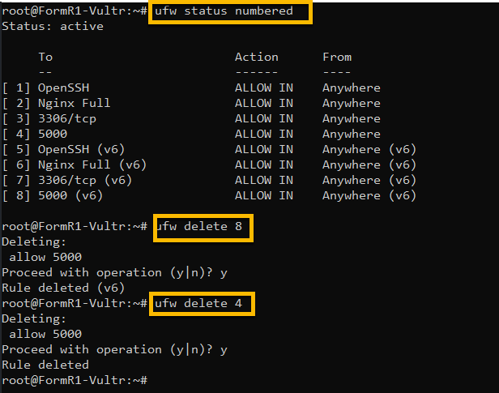


<h3> Congratulations your Ubuntu server is secure and ready for action. </h3> 

<a class="page-back" href="Setup/fr0305_Setup-Data-Server-Ubuntu.md">BACK - Install Database Server</a>
<a class="page-next disabled">NEXT</a>
